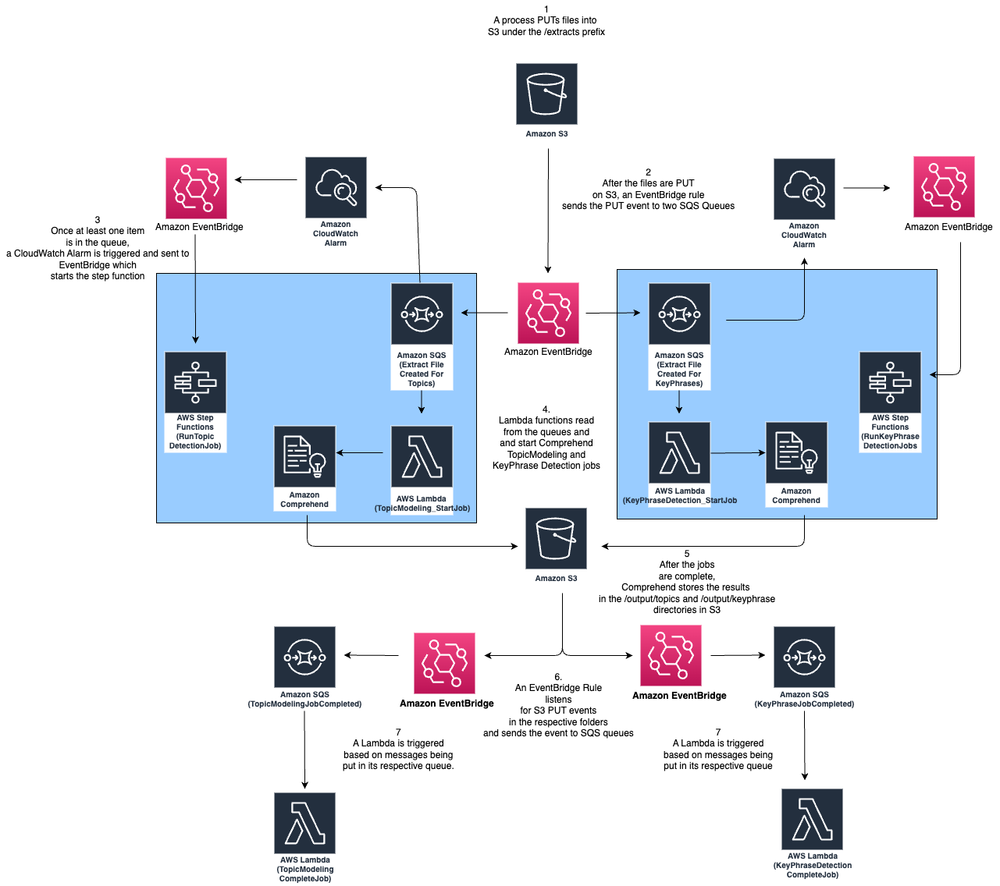

# Comprehend-JobRunner

You can use Amazon Comprehend to examine the content of a collection of documents to determine common themes. For example, you can give Amazon Comprehend a collection of news articles, and it will determine the subjects, such as sports, politics, or entertainment. The text in the documents doesn't need to be annotated.

You can also use it to detect Key phrases.

A key phrase is a string containing a noun phrase that describes a particular thing. It generally consists of a noun and the modifiers that distinguish it. For example, "day" is a noun; "a beautiful day" is a noun phrase that includes an article ("a") and an adjective ("beautiful"). Each key phrase includes a score that indicates the level of confidence that Amazon Comprehend has that the string is a noun phrase. You can use the score to determine if the detection has high enough confidence for your application.

Amazon Comprehend JobRunner processes files that are copied to S3 to find [Topics](https://docs.aws.amazon.com/comprehend/latest/dg/topic-modeling.html) and [Keyphrases](https://docs.aws.amazon.com/comprehend/latest/dg/how-key-phrases.html).  

The process automatically throttles the number of concurrently running jobs based on your account's [service quotas](https://docs.aws.amazon.com/comprehend/latest/dg/guidelines-and-limits.html).

There are [known limitations with using Lambda concurrency limits with SQS triggers](https://zaccharles.medium.com/lambda-concurrency-limits-and-sqs-triggers-dont-mix-well-sometimes-eb23d90122e0). The Job Runner handles concurrency internally using [AWS Step Functions](https://docs.aws.amazon.com/step-functions/latest/dg/amazon-states-language-state-machine-structure.html).  The state machines are invoked when an [AWS CloudWatch Alarm](https://docs.aws.amazon.com/AWSSimpleQueueService/latest/SQSDeveloperGuide/set-cloudwatch-alarms-for-metrics.html) detects messages in the corresponding queue.




## Prerequisites: 

- The [AWS CLI](https://aws.amazon.com/cli/) should be [properly configured](https://docs.aws.amazon.com/cli/latest/userguide/cli-chap-configure.html)
- [AWS Serverless Application Model](https://aws.amazon.com/serverless/sam/)
- [Docker](https://www.docker.com/)

## Deployment

```bash
sam build --use-container
sam deploy --guided
```

## Using the Job Runner within a larger project

When the processing is complete, the Lambdas ```keyphrase_detection_completed_job``` and ```topic_detection_complete_job``` are called.  Here you can add your business specific login in the ```ProcessKeyPhrases``` and the ```ProcessTopics``` functions respectively.

For more information about Topic Modeling and Key phrase detection, read the following AWS Documenation:

- [Topic Modeling](https://docs.aws.amazon.com/comprehend/latest/dg/topic-modeling.html)
- [Key Phrase Detection](https://docs.aws.amazon.com/comprehend/latest/dg/how-key-phrases.html)
